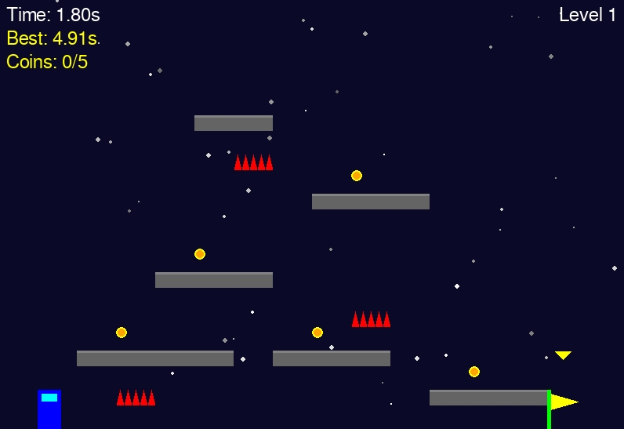

# Speedrun Challenge



A 2D platformer game where the goal is to reach the finish line as quickly as possible.

## Features
- Time tracking for speedrunning
- Obstacle course with platforms and hazards
- Best time saving
- Simple controls (arrow keys to move, spacebar to jump)

## Installation
1. Install Python 3.8 or higher
2. Install dependencies:
```
pip install -r requirements.txt
```
3. Run the game:
```
python main.py
```

## Controls
- Left/Right Arrow: Move left/right
- Spacebar: Jump
- R: Reset level
- ESC: Quit game 